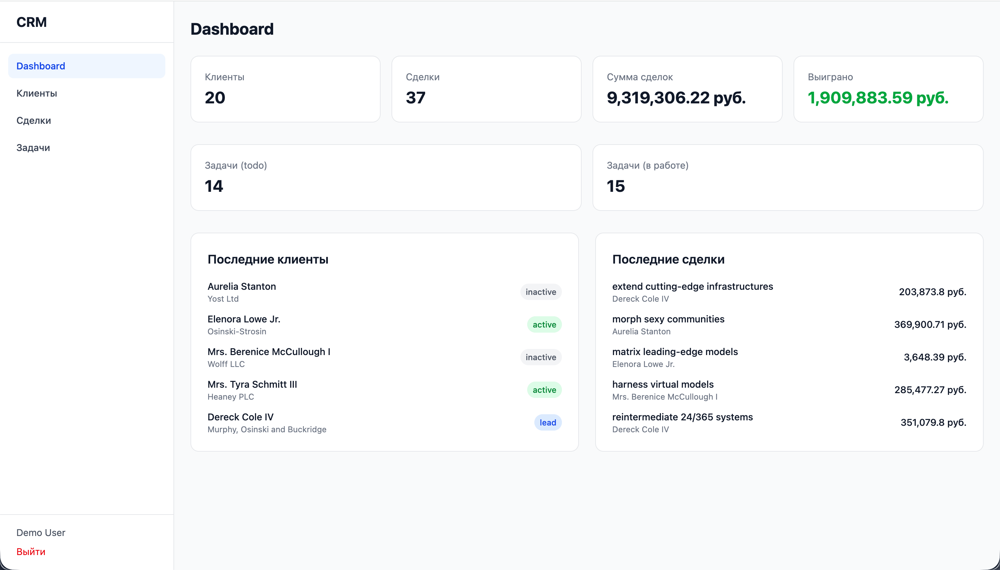

# Fullstack CRM

Мини-CRM система: управление клиентами, сделками и задачами. Запускается одной командой.



## Стек

- **Backend:** PHP 8.4, Laravel 13, Sanctum (cookie-based auth)
- **Frontend:** React 19, TypeScript, Vite, Tailwind CSS 4
- **БД:** PostgreSQL 17
- **Кеш/сессии:** Redis 7.4
- **Инфраструктура:** Docker, Nginx, docker-compose

## Запуск

```bash
cp .env.example .env
docker compose up --build
```

Приложение доступно на http://localhost:8080

### Демо-данные

```bash
docker compose exec backend php artisan migrate --seed
```

Логин: `demo@example.com` / Пароль: `password`

## API

Все эндпоинты под префиксом `/api`.

### Auth

| Метод | URL | Описание |
|-------|-----|----------|
| POST | /api/auth/register | Регистрация |
| POST | /api/auth/login | Вход |
| POST | /api/auth/logout | Выход |
| GET | /api/auth/user | Текущий пользователь |

### CRUD

| Ресурс | Эндпоинты |
|--------|-----------|
| Клиенты | GET/POST /api/clients, GET/PUT/DELETE /api/clients/{id} |
| Сделки | GET/POST /api/deals, GET/PUT/DELETE /api/deals/{id} |
| Задачи | GET/POST /api/tasks, GET/PUT/DELETE /api/tasks/{id} |
| Dashboard | GET /api/dashboard |

Фильтрация: `?status=active`, `?stage=won`, `?search=...`

## Тесты

```bash
docker compose exec backend php artisan test
```

## Структура

```
fullstack-crm/
├── docker-compose.yml
├── .env.example
├── docker/
│   ├── nginx/default.conf
│   ├── php/Dockerfile, docker-entrypoint.sh, local.ini
│   └── node/Dockerfile
├── backend/          # Laravel REST API
│   ├── app/
│   │   ├── Enums/    # ClientStatus, DealStage, TaskStatus
│   │   ├── Models/   # User, Client, Deal, Task
│   │   └── Http/     # Controllers, Requests, Resources
│   ├── database/     # Migrations, Factories, Seeders
│   ├── routes/api.php
│   └── tests/Feature/
└── frontend/         # React SPA
    └── src/
        ├── contexts/ # AuthContext
        ├── components/ # AppLayout, PrivateRoute
        ├── pages/    # Dashboard, Clients, Deals, Tasks, Login, Register
        ├── lib/      # Axios instance
        └── types/    # TypeScript interfaces
```
